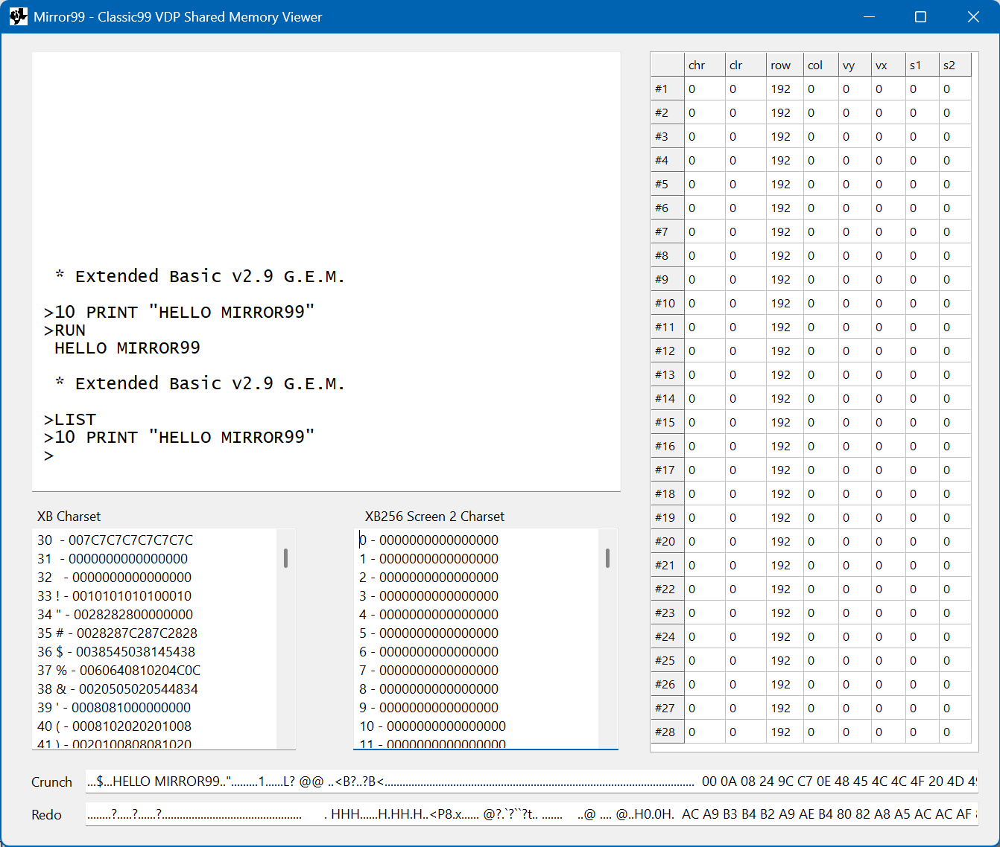

# Mirror99 - Classic99 VDP Shared Memory Viewer

This little program is viewer for the video-memory (VDP RAM) of the [Classic99 ]((https://github.com/tursilion/classic99))TI-99/4a Emulator by Tursi. It accesses the shared memory and displays

- Screen Display (Standard Color Mode 32x24)

- Sprite Attribute and Motion Tables

- Standard (Extended) BASIC Character Set and XB256 Screen 2 Character Set

- Crunch-Buffer Text and Hex

- Redo-Buffer Text and Hex

 

Please note, that some programs and cartridges use another memery layout.

## Instructions

You need to enable two features in the classic99.ini:

```
[debug]
enableDebugger=1
enableDebugSharedMem=1
```

Then just start Classic99 first and then Mirror99.exe

Enjoy.
